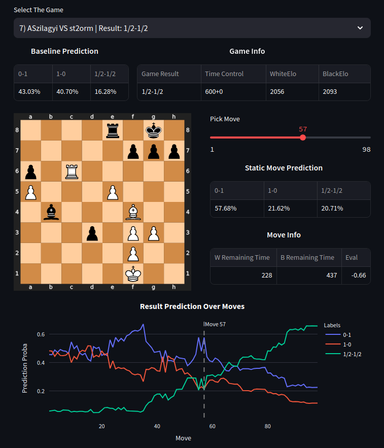

# ChessWinnerPrediction

<a target="_blank" href="https://cookiecutter-data-science.drivendata.org/">
    
</a>

<a target="_blank" href="https://mlflow.org/">
    
</a>

<a target="_blank" href="https://optuna.org/">
    
</a>

<a target="_blank" href="https://streamlit.io/">
    
</a>

<a target="_blank" href="https://github.com/niklasf/python-chess">
    
</a>

<a target="_blank" href="https://scikit-learn.org/">
    
</a>

<a target="_blank" href="https://pandas.pydata.org/">
    
</a>

<a target="_blank" href="https://numpy.org/">
    
</a>

<a target="_blank" href="https://plotly.com/">
    
</a>

<a target="_blank" href="https://seaborn.pydata.org/">
    
</a>

<a target="_blank" href="https://pypi.org/project/zstandard/">
    
</a>

<a target="_blank" href="https://jupyter.org/">
    
</a>

---

## Content

- [Project Description](#project-description)
- [Installation and Running a Demo](#installation-and-running-a-demo)
- [Data](#data)
- [Project Organization](#project-organization)
- [Static Move Solution](#static-move-solution)

## Project Description

The **Chess Winner Prediction** project is a machine learning initiative following the **Cookiecutter Data Science** structure. The goal of this project is to predict the winner of a chess game using various approaches.

I made two different solutions:

1. **[Baseline Solution:](https://github.com/Tikhon-Radkevich/Chess-Winner-Prediction/tree/main/notebooks/baseline_notebooks)**  
   This is a straightforward model that predicts the outcome of a chess game based on pre-game information such as player Elo ratings and the base time of the game.  

2. **Static Move Solution**:  
   This approach makes predictions using in-game data, including move evaluations, remaining time, number of pieces on the board, and more. 

---

## Installation and Running a Demo

To get started with the Chess Winner Prediction project, follow the steps below:

#### Clone the Repository

```bash
git clone https://github.com/Tikhon-Radkevich/Chess-Winner-Prediction.git
cd Chess-Winner-Prediction
```

#### Set Up the Virtual Environment

```bash
python -m venv .venv
source .venv/bin/activate
```

#### Install Dependencies

```bash
pip install -r requirements.txt
pip install -e .
```

#### Run the Demo

```bash
streamlit run ./demo/main.py
```
--- 

#### Demo



---

## Data
Dataset source: lichess.org [standard games](https://database.lichess.org/#standard_games)  
Dataset represented as .pgn.zst archive files.
#### [Sample Example:](https://database.lichess.org/#standard_games:~:text=SHA256%20checksums.-,Sample,-%5BEvent%20%22Rated%20Bullet)

```text
[Event "Rated Bullet tournament]      [Site "https://lichess.org/PpwPOZMq"]
[White "Abbot"]                       [Black "Costello"]
[WhiteElo "2100"]                     [BlackElo "2000"]
[WhiteRatingDiff "-4"]                [BlackRatingDiff "+1"]
[Result "0-1"]                        [ECO "B30"]
[TimeControl "300+0"]                 [Termination "Time forfeit"]

1. e4 { [%eval 0.17] [%clk 0:00:30] } 1... c5 { [%eval 0.19] [%clk 0:00:30] }
2. Nf3 { [%eval 0.25] [%clk 0:00:13] } 2... Nc6 { [%eval 0.33] [%clk 0:00:27] }
3. b3?? { [%eval -4.14] [%clk 0:00:02] } 3... Nf4? { [%eval -2.73] [%clk 0:00:21] } 0-1
```

## Project Organization
project structure based on [Cookiecutter Data Science](https://drivendata.github.io/cookiecutter-data-science/)

```
├── chesswinnerprediction        <- Source code for use in this project.
│   │
│   ├── baseline           <- source code for baseline solution: models, data processing and visualization utils.
│   ├── static_move        <- source code for static move solution.
│   ├── dataloader         <- Scripts to download and process zst archive from lichess.org to csv.
│   ├── processing         <- Scripts to preprocess data for baseline and static move solutions.
│   └── visualizations     <- Functions to create exploratory and results oriented visualizations
│
├── notebooks                    <- Jupyter notebooks: models, visualizations, and data exploration.
│   │
│   ├── baseline_notebooks <- baseline solution: reamde file, notebooks with different models like: 
│   │                          logistic regression, knn, desicion tree, random forest and boosting.
│   └── static_move        <- Solution based on Hist Gradient Boosting Classifier from scikit-learn.
│
├── scripts                      <- Scripts to download and process zst archive from lichess.org to csv. 
│                                   Also, scripts to preprocess data for baseline and static move solutions.
│
├── data                         <- Data files for use in this project, including example data for demo.
│
├── models                       <- Trained baseline and static move models for demo.
│
├── demo                         <- Streamlit web app for demo.
│
├── README.md          <- The top-level README for developers using this project.
│
├── requirements.in    <- The high-level requirements.
│
└── requirements.txt   <- The requirements file for reproducing the analysis environment, e.g.
                          generated with `pip-tools compile -o requirements.txt`
```

---

## Static Move Solution


