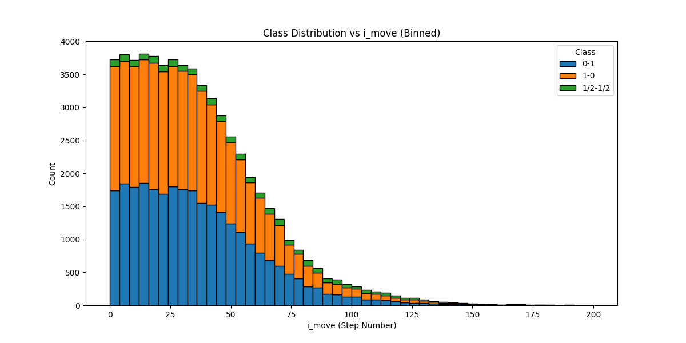

# ChessWinnerPrediction

[](https://cookiecutter-data-science.drivendata.org/)
[](https://mlflow.org/)
[](https://optuna.org/)
[](https://streamlit.io/)
[](https://github.com/niklasf/python-chess)
[](https://scikit-learn.org/)
[](https://pandas.pydata.org/)
[](https://numpy.org/)
[](https://plotly.com/)
[](https://seaborn.pydata.org/)
[](https://pypi.org/project/zstandard/)
[](https://jupyter.org/)

---

## Content

- [Project Description](#project-description)
- [Installation and Running a Demo](#installation-and-running-a-demo)
- [Data](#data)
- [Project Organization](#project-organization)
- [Static Move Solution](#static-move-solution)
  - [Dataset Overview](#dataset-overview)
  - [Hist Gradient Boosting Classifier](#hist-gradient-boosting-classifier)

## Project Description

The **Chess Winner Prediction** project is a machine learning initiative following the **Cookiecutter Data Science** structure. The goal is to predict the winner of a chess game using two distinct approaches:

| **Solution**                                                                                                                | **Description**                                                                                                                                           |
|-----------------------------------------------------------------------------------------------------------------------------|-----------------------------------------------------------------------------------------------------------------------------------------------------------|
| **[Baseline Solution](https://github.com/Tikhon-Radkevich/Chess-Winner-Prediction/tree/main/notebooks/baseline_notebooks)** | Focuses on pre-game information, such as **player Elo ratings** and **game base time**. This straightforward model acts as the foundation for comparison. |
| **[Static Move Solution](#static-move-solution)**                                                                           | Utilizes **in-game data**, including **move evaluations**, remaining time, and the number of pieces on the board, to enhance prediction accuracy.         |

## Installation and Running a Demo

To get started with the Chess Winner Prediction project, follow the steps below:

#### Clone the Repository

```bash
git clone https://github.com/Tikhon-Radkevich/Chess-Winner-Prediction.git
cd Chess-Winner-Prediction
```

#### Set Up the Virtual Environment

```bash
python -m venv .venv
source .venv/bin/activate
```

#### Install Dependencies

```bash
pip install -r requirements.txt
pip install -e .
```

#### Run the Demo

```bash
streamlit run ./demo/main.py
```
---


---

## Data
Dataset source: lichess.org [standard games](https://database.lichess.org/#standard_games)  
Dataset represented as .pgn.zst archive files.
#### [Sample Example:](https://database.lichess.org/#standard_games:~:text=SHA256%20checksums.-,Sample,-%5BEvent%20%22Rated%20Bullet)

```text
[Event "Rated Bullet tournament]      [Site "https://lichess.org/PpwPOZMq"]
[White "Abbot"]                       [Black "Costello"]
[WhiteElo "2100"]                     [BlackElo "2000"]
[WhiteRatingDiff "-4"]                [BlackRatingDiff "+1"]
[Result "0-1"]                        [ECO "B30"]
[TimeControl "300+0"]                 [Termination "Time forfeit"]

1. e4 { [%eval 0.17] [%clk 0:00:30] } 1... c5 { [%eval 0.19] [%clk 0:00:30] }
2. Nf3 { [%eval 0.25] [%clk 0:00:13] } 2... Nc6 { [%eval 0.33] [%clk 0:00:27] }
3. b3?? { [%eval -4.14] [%clk 0:00:02] } 3... Nf4? { [%eval -2.73] [%clk 0:00:21] } 0-1
```

## Project Organization
project structure based on [Cookiecutter Data Science](https://drivendata.github.io/cookiecutter-data-science/)

```
├── chesswinnerprediction        <- Source code for use in this project.
│   │
│   ├── baseline           <- source code for baseline solution: models, data processing and visualization utils.
│   ├── static_move        <- source code for static move solution.
│   ├── dataloader         <- Scripts to download and process zst archive from lichess.org to csv.
│   ├── processing         <- Scripts to preprocess data for baseline and static move solutions.
│   └── visualizations     <- Functions to create exploratory and results oriented visualizations
│
├── notebooks                    <- Jupyter notebooks: models, visualizations, and data exploration.
│   │
│   ├── baseline_notebooks <- baseline solution: reamde file, notebooks with different models like: 
│   │                          logistic regression, knn, desicion tree, random forest and boosting.
│   └── static_move        <- Solution based on Hist Gradient Boosting Classifier from scikit-learn.
│
├── scripts                      <- Scripts to download and process zst archive from lichess.org to csv. 
│                                   Also, scripts to preprocess data for baseline and static move solutions.
│
├── data                         <- Data files for use in this project, including example data for demo.
│
├── models                       <- Trained baseline and static move models for demo.
│
├── demo                         <- Streamlit web app for demo.
│
├── README.md          <- The top-level README for developers using this project.
│
├── requirements.in    <- The high-level requirements.
│
└── requirements.txt   <- The requirements file for reproducing the analysis environment, e.g.
                          generated with `pip-tools compile -o requirements.txt`
```

---

## Static Move Solution

### Dataset Overview

**Dataset source:** [lichess_db_standard_rated_2017-05](https://database.lichess.org/#:~:text=11%2C693%2C919-,.pgn.zst,-/%20.torrent)

| Result | Event            | eval | EloDiff | MeanElo | BaseTime | IncrementTime | time_diff_norm | white_remaining_time_norm | black_remaining_time_norm | white_time_per_move | black_time_per_move | white_increment_pct_in_time_per_move | black_increment_pct_in_time_per_move | white_time_will_end_on_move | black_time_will_end_on_move | i_move | w_score | b_score | n_pieces |
|--------|------------------|------|---------|---------|----------|---------------|----------------|---------------------------|---------------------------|---------------------|---------------------|--------------------------------------|--------------------------------------|-----------------------------|-----------------------------|--------|---------|---------|----------|
| 0-1    | Rated Blitz game | 6.72 | -41     | 1580.5  | 300      | 0             | -0.323333      | 0.256667                  | 0.580000                  | 0.016895            | 0.009546            | 0.0                                  | 0.0                                  | 15.191926                   | 60.75554                    | 44     | 35      | 34      | 27       |
| 1-0    | Rated Blitz game | 0.10 | 18      | 1572.0  | 300      | 0             | -0.013333      | 0.910000                  | 0.923333                  | 0.003914            | 0.003334            | 0.0                                  | 0.0                                  | 200.000000                  | 200.00000                   | 23     | 38      | 38      | 30       |

* **Result**: The target variable representing the outcome of the game.  
* **i_move**: The number of moves played so far, including both white and black moves.  
* **EloDiff**: The difference in Elo ratings between White and Black players, calculated as `WhiteElo - BlackElo`.  
* **remaining_time_norm**: The remaining time for a player normalized by the base time, where the lower bound is 0.0 (no time left) and the upper bound is 1.0 (full base time remaining).  
* **time_diff_norm**: The difference in normalized remaining time between white and black, calculated as `white_remaining_time_norm - black_remaining_time_norm`.  
* **time_per_move**: The average time per move, calculated as `(1 - time_diff_norm) / i_move`.  
* **time_will_end_on_move**: The projected move number when the player will run out of time, calculated as `remaining_time_norm / time_per_move`, where the upper bound is 200.
* **increment_pct_in_time_per_move**: The percentage of the increment time per move, calculated as `increment_time / time_per_move`.  
* **score**: The material score, where each piece is assigned a value:  
  * 1 for a pawn  
  * 3 for a knight or bishop  
  * 5 for a rook  
  * 9 for a queen  

#### Target to i_move Distribution:



### Hist Gradient Boosting Classifier
Notebook: [histGBC_implementation.ipynb](notebooks/static_move/histGBC_implementation.ipynb)


